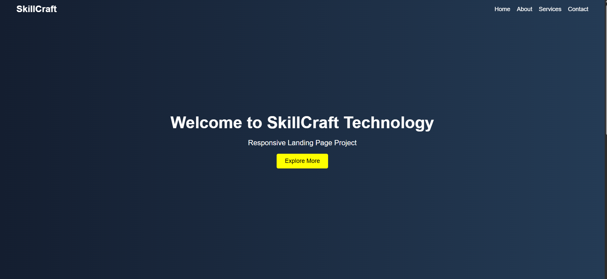

# Responsive Landing Page

A clean, modern, and responsive landing page developed using HTML, CSS, and JavaScript as part of the SkillCraft Technology Web Development Internship (Task 1).

## Live Preview
You can view the live site here: [https://darshannaidu.github.io/SCT_WD_1/](https://darshannaidu.github.io/SCT_WD_1/)

## Screenshot

## Features

- **Fixed Navigation Bar**: Stays at the top of the viewport for easy navigation.
- **Dynamic Navbar Scroll Effect**: Changes background color from transparent to solid black upon scrolling down.
- **Interactive Hover Effects**: Visual feedback on interactive elements (links and buttons).
- **Fully Responsive Design**: Optimized for desktops, tablets, and mobile devices.
- **Sections**:
  - Hero section with a dark blue-indigo gradient background and call-to-action button.
  - About section highlighting SkillCraft.
  - Services section highlighting offerings.
  - Footer section with copyright information.

## Technologies Used

- **HTML5**: Structured semantic layout.
- **CSS3**: Custom styling, Flexbox layout, media queries for responsiveness, and smooth transitions.
- **JavaScript (ES6)**: Scroll-event handling to dynamically toggle CSS classes on the navbar.

## Learning Outcomes

- HTML Structure Design
- CSS Styling, Layouts, and Flexbox
- Responsive Web Design with Media Queries
- JavaScript DOM Manipulation & Scroll Event Handling

## Author

**Darshan Naidu**

## Project Status

Completed
